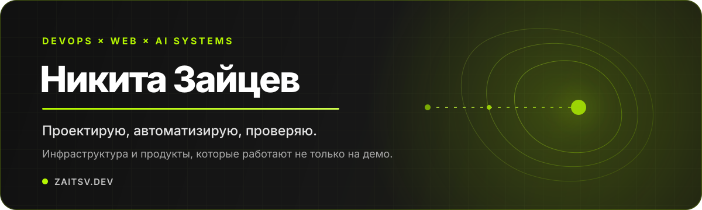

<div align="center">
  

  <br />

  <a href="https://zaitsv.dev"><b>Сайт и портфолио</b></a>
  ·
  <a href="https://zaitsv.dev/blog"><b>Блог</b></a>
  ·
  <a href="https://t.me/nzaitsv"><b>Telegram</b></a>
  ·
  <a href="mailto:nikita@zaitsv.dev"><b>Почта</b></a>
</div>

## Привет. Я Никита 👋

DevOps-инженер и веб-разработчик с **6+ годами практики**. Собираю инфраструктуру, внутренние инструменты и веб-продукты — от идеи и кода до CI/CD, наблюдаемости и спокойной эксплуатации.

Мой главный принцип: **система должна работать не только на красивом демо**. Поэтому я проверяю реальный путь запроса, отказоустойчивость, безопасность, обновления и то, что произойдёт после следующего деплоя.

```text
задача → архитектура → код → автоматизация → проверка → работающий контур
```

### Чем занимаюсь

- 🧱 **Инфраструктура:** Docker, Caddy, Linux, CI/CD, наблюдаемость и безопасные контуры доступа.
- ⚙️ **Разработка:** TypeScript, Go, Python, PHP, API, Telegram-боты и прикладные веб-сервисы.
- 🤖 **AI-инженерия:** агентные процессы, память, MCP, OpenAI-совместимые API и управляемый доступ AI к живым системам.
- 🔐 **Безопасность:** аудит кода и конфигурации, секреты, авторизация, зависимости и проверяемые границы полномочий.

## Избранные проекты

<table>
<tr>
<td width="50%" valign="top">
<h3><a href="https://github.com/WEBzaytsev/yookassa-ts-sdk">YooKassa TypeScript SDK</a></h3>
<p>Типизированный SDK для платежей, возвратов, чеков и вебхуков YooKassa. Автоматические повторы, идемпотентность, ограничение запросов и поддержка нескольких сред выполнения.</p>
<p><code>TypeScript</code> · <code>Payments</code> · <code>SDK</code></p>
</td>
<td width="50%" valign="top">
<h3><a href="https://github.com/WEBzaytsev/infisical-docker-sync">Infisical Docker Sync</a></h3>
<p>Агент синхронизации секретов из Infisical в Docker Compose. Разделяет доступ к секретам и Docker socket, пересоздаёт только нужные контейнеры.</p>
<p><code>TypeScript</code> · <code>Docker</code> · <code>Secrets</code></p>
</td>
</tr>
<tr>
<td width="50%" valign="top">
<h3><a href="https://github.com/WEBzaytsev/caddy-dns-pro">Caddy DNS Pro</a></h3>
<p>Готовый образ Caddy с DNS-провайдерами, автоматическим TLS, rate limiting и корректной работой за Cloudflare.</p>
<p><code>Caddy</code> · <code>Docker</code> · <code>DNS</code> · <code>TLS</code></p>
</td>
<td width="50%" valign="top">
<h3><a href="https://github.com/WEBzaytsev/hermes-consensus-planner">Hermes Consensus Planner</a></h3>
<p>Многоагентное планирование для сложных задач: независимые варианты, перекрёстная проверка, обсуждение разногласий и явная передача нерешённых рисков человеку.</p>
<p><code>Python</code> · <code>AI Agents</code> · <code>Hermes</code></p>
</td>
</tr>
<tr>
<td width="50%" valign="top">
<h3><a href="https://github.com/WEBzaytsev/forward-auth">Forward Auth</a></h3>
<p>Небольшой шлюз аутентификации для Caddy: общий код доступа, TOTP, защищённые сессии и ограничения на попытки входа.</p>
<p><code>Next.js</code> · <code>Caddy</code> · <code>Security</code></p>
</td>
<td width="50%" valign="top">
<h3><a href="https://github.com/WEBzaytsev/scripts">Server Toolkit</a></h3>
<p>Набор утилит для типовых серверных операций: усиление SSH, UFW, Docker, BBR, мониторинг и экстренный отзыв ключей.</p>
<p><code>Shell</code> · <code>Linux</code> · <code>Operations</code></p>
</td>
</tr>
</table>

## Рабочий стек

**Инфраструктура**<br />
`Linux` `Docker` `Docker Compose` `Caddy` `GitHub Actions` `Woodpecker CI` `PostgreSQL` `Redis` `RabbitMQ` `Grafana` `Sentry`

**Разработка**<br />
`TypeScript` `Node.js` `NestJS` `Next.js` `Vue` `Go` `Python` `PHP` `WordPress` `REST API`

**Инженерия AI-систем**<br />
`Hermes Agent` `MCP` `GBrain` `Hindsight` `pgvector` `AI agents` `OpenAI-compatible APIs`

## Пишу о том, что проверил руками

- [Свой OpenAI API поверх Codex: от прокси до рабочего контура](https://zaitsv.dev/blog/svoy-openai-api-poverh-codex-subscription)
- [Hermes Agent в работе: AI-агент как инженерный исполнитель](https://zaitsv.dev/blog/hermes-agent-v-rabote-ai-agent-kak-inzhenernyy-ispolnitel)
- [Чек-лист безопасности, который можно отдать ИИ](https://zaitsv.dev/blog/beregite-ochko-smolodu-chek-list)

## Можно прийти с задачей

Помогаю спроектировать инфраструктуру, автоматизировать выпуск, разобрать узкие места, провести технический аудит или довести внутренний инструмент до нормальной эксплуатации.

<div align="center">
  <br />
  <b>Код — это начало. Работающая и проверяемая система — результат.</b>
  <br /><br />
  <a href="https://t.me/nzaitsv">Написать в Telegram</a>
  ·
  <a href="mailto:nikita@zaitsv.dev">nikita@zaitsv.dev</a>
</div>
